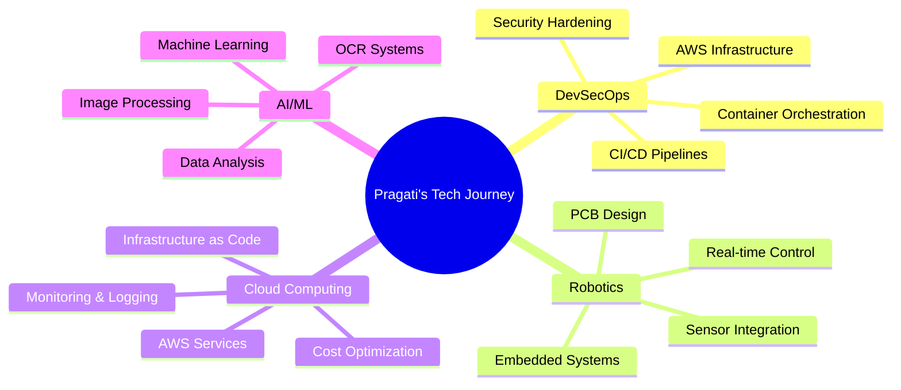

<div align="center">


</div>

<div align="center">
  
# 🚀 AWS Cloud Practitioner | DevSecOps Engineer | Robotics Innovator

### Building Secure, Scalable Cloud Infrastructure & Intelligent Robotic Systems

[](https://git.io/typing-svg)

[](https://www.linkedin.com/in/pragati-basnet-573106263/)
[](https://github.com/PragatiBasnet29)
[](mailto:pragatibasnet123@gmail.com)
[](#)

</div>

---

## 👋 About Me

```python
class PragatiBasnet:
    def __init__(self):
        self.name = "Pragati Basnet"
        self.location = "Kathmandu, Nepal 🇳🇵"
        self.education = "B.E. in Electronics and Communication Engineering"
        self.certifications = ["AWS Certified Cloud Practitioner"]
        self.role = "DevSecOps Engineer | Robotics Developer"
        
    def current_work(self):
        return {
            "company": "Gritfeat Solution",
            "position": "DevSecOps Intern",
            "focus": [
                "Building secure CI/CD pipelines",
                "AWS infrastructure automation",
                "Kubernetes deployments",
                "Security hardening & compliance"
            ]
        }
    
    def expertise(self):
        return [
            "☁️ Cloud: AWS (EC2, Lambda, S3, IAM, CloudWatch)",
            "🔒 DevSecOps: CI/CD, Docker, Kubernetes, Terraform",
            "🤖 Robotics: Arduino, ESP32, Embedded Systems, PCB Design",
            "💻 Backend: Python (Django, Flask), SQL, MySQL",
            "🔧 Hardware: Sensors, Motors, PID Control, Real-time Systems"
        ]
    
    def fun_fact(self):
        return "I build robots that solve mazes and cloud systems that scale to millions! 🚀"
```

<details>
<summary>📖 More about my journey...</summary>
<br>

I'm a **Robotics Engineer** and **AWS Certified Cloud Practitioner** with hands-on experience in designing real-time robotic systems and building secure cloud infrastructure. My work spans from low-level embedded systems to high-level cloud architecture.

**What drives me:**
- 🔐 Building **secure, scalable** cloud infrastructure
- 🤖 Creating **intelligent robotic systems** that solve real-world problems
- 🌱 **Continuous learning** and sharing knowledge with the community
- 🤝 **Mentoring** aspiring engineers and contributing to tech communities

**Recent Achievements:**
- ✅ AWS Certified Cloud Practitioner
- ✅ DevSecOps Intern at Gritfeat Solution
- ✅ AWS UG Women in Tech Meetup Organizer & Speaker
- ✅ Published research on Hardware Integrated OCR System
- ✅ Built 10+ robotics projects including Micromouse Maze Solver

</details>

---

## 💼 Professional Experience

### 🔒 DevSecOps Intern | Gritfeat Solution
**Jul 2025 - Nov 2025 | Remote**

```yaml
Responsibilities:
  - Built and maintained secure CI/CD pipelines with GitHub Actions
  - Hardened AWS environments using IAM, security groups, and NACLs
  - Containerized services with Docker and deployed on Kubernetes
  - Automated Linux server operations with Bash scripting
  - Implemented infrastructure as code using Terraform
  - Configured Nginx for reverse proxy and load balancing
  - Set up comprehensive monitoring with CloudWatch and CloudTrail
  
Technologies: AWS, Docker, Kubernetes, Terraform, GitHub Actions, Nginx, Linux
```

### 🔧 Hardware Quality Assurance Intern | RealTimeSolutions

```yaml
Projects:
  - Automated card-based door unlocking system (embedded C)
  - Tested submersible ultrasonic level sensors
  - Developed ESP32-S3 applications with 4-inch LED display
  - Real-time data visualization and sensor integration
  
Technologies: ESP32-S3, Embedded C, Sensors, Real-time Systems
```

---

## 🛠️ Technical Skills

<div align="center">

### ☁️ DevSecOps & Cloud Infrastructure


### 💻 Programming & Backend


### 🎨 Frontend & Design


### 🤖 Robotics & Hardware


### 🧠 AI/ML & Blockchain


</div>

---

## 🌟 Featured Projects

### 🔐 DevSecOps & Cloud

<div align="center">
<table>
<tr>
<td width="50%">

#### 🚀 PrashnaKhoj DevOps
**Full-stack Q&A Platform**

- Dockerized complete application stack
- Deployed on AWS EC2 with IAM & SSH
- CI/CD with GitHub Actions
- CloudWatch logging & monitoring
- GitOps infrastructure management

**Tech:** Docker, AWS EC2, GitHub Actions, CloudWatch

[View Project →](https://github.com/PragatiBasnet29/DevOpsProjectWithFrontEnd)

</td>
<td width="50%">

#### ⛓️ Blockchain Real Estate
**Decentralized Property Platform**

- Smart contracts in Solidity
- Ethereum Testnet deployment
- Secure Next.js frontend
- Blockchain-verified transactions
- Decentralized property listings

**Tech:** Solidity, Ethereum, Next.js, Web3

</td>
</tr>
</table>
</div>

### 🤖 Robotics & Hardware

<div align="center">
<table>
<tr>
<td width="50%">

#### 🐭 Micromouse Maze Solver
**Autonomous Maze-Solving Robot**

- Wall-following logic algorithm
- Arduino Nano implementation
- Path optimization after traversal
- Real-time decision making
- Competition-ready design

**Tech:** Arduino, C++, Sensors, PID Control

⭐ **1 Star**

</td>
<td width="50%">

#### 🚨 Earthquake Alert System
**Real-time Disaster Warning**

- ADXL accelerometer sensors
- P-wave detection across nodes
- GSM module integration
- SMS alert system
- Low-cost community safety

**Tech:** Arduino, GSM, Accelerometer, IoT

⭐ **1 Star**

</td>
</tr>
<tr>
<td width="50%">

#### ⚽ Robo Soccer Bot
**Wireless Controlled Robot**

- Arduino Nano controller
- Bluetooth wireless control
- Brushless motor drive
- Rotating kicker mechanism
- Competitive match-ready

**Tech:** Arduino, Bluetooth, BLDC Motors

</td>
<td width="50%">

#### 🏎️ PID Line Following Robot
**High-Speed Autonomous Bot**

- PID control algorithm
- Speed optimization
- Enhanced stability
- Dynamic response tuning
- Accurate line tracking

**Tech:** Arduino, PID, IR Sensors

</td>
</tr>
</table>
</div>

### 🧠 AI/ML & Full-Stack

<div align="center">
<table>
<tr>
<td width="50%">

#### 📄 Devanagari OCR System
**Hardware Integrated Scanner**

- Nepali citizenship scanner
- ~90% accuracy on 80+ docs
- Custom OCR pipeline
- Hardware integration
- **Research paper in progress**

**Tech:** Python, OpenCV, ML, Hardware

</td>
<td width="50%">

#### 🍽️ GharKoSWAD
**Community Food Platform**

- Django REST backend
- React + Tailwind frontend
- Maps API integration
- Community-driven platform
- **Bolt Global Hackathon 2025**

**Tech:** Django, React, Tailwind, Maps API

</td>
</tr>
</table>
</div>

---

## 📊 GitHub Statistics

<div align="center">


</div>

<div align="center">
  


</div>

<div align="center">

### 📈 Contribution Activity
[](https://github.com/PragatiBasnet29)

</div>

---

## 🏆 Achievements & Certifications

<div align="center">


</div>

### 🎖️ GitHub Trophies

<div align="center">


</div>

### 🌟 Highlights

- ✅ **AWS Certified Cloud Practitioner** - Amazon Web Services
- 🎤 **AWS UG Women in Tech Meetup** - Organizer & Speaker (Pokhara)
- 🤖 **Robotics Club PR Manager** - Pashchimanchal Campus
- 👥 **Mentor & Hardware Lead** - Robotics Projects
- 🎓 **SheCan Fellowship** - Mentee
- 🦋 **Breaking Out of the Cocoon - Sequel** - Fellow
- 🏆 **Bolt Global Hackathon 2025** - Strong Positive Feedback (GharKoSWAD)
- 📝 **Research Paper** - Hardware Integrated OCR (In Progress)

---

## 💡 What I'm Currently Doing

<div align="center">

| 🎯 Focus Area | 📝 Current Activity |
|:---:|:---:|
| 🔭 **Working on** | Secure CI/CD pipelines & AWS infrastructure at Gritfeat Solution |
| 🌱 **Learning** | Advanced Kubernetes, AWS Solutions Architect, Security Best Practices |
| 👯 **Collaborating on** | Open-source DevOps tools & robotics projects |
| 💬 **Ask me about** | AWS, DevSecOps, Docker, Kubernetes, Robotics, Arduino, ESP32 |
| 📝 **Publishing** | Research paper on Devanagari OCR system |
| 🎤 **Speaking** | AWS & Cloud technologies at community meetups |

</div>

---

## 📚 Technical Blog & Writing

<div align="center">



</div>

<!-- BLOG-POST-LIST:START -->
- 🔐 Building Secure CI/CD Pipelines with GitHub Actions
- ☁️ AWS Best Practices: Security Groups vs NACLs
- 🤖 Real-time Earthquake Detection using IoT
- 🐳 Docker to Kubernetes: A Migration Guide
- 📊 Monitoring AWS Infrastructure with CloudWatch
<!-- BLOG-POST-LIST:END -->

---

## 🤝 Let's Connect!

<div align="center">

I'm always excited to collaborate on interesting projects, discuss cloud architecture, robotics, or just connect with fellow tech enthusiasts!

[](https://www.linkedin.com/in/pragati-basnet-573106263/)
[](https://github.com/PragatiBasnet29)
[](mailto:pragatibasnet123@gmail.com)
[](tel:9742456686)

</div>

---

## 💭 Quote of the Day

<div align="center">


**"The cloud is limitless, robotics makes it tangible, and DevSecOps makes it secure."** 💫

</div>

---

<div align="center">

### 👁️ Profile Views Counter


<br>

### ⭐ If you like my work, consider giving a star to my repositories!

**Building the future, one commit at a time** 🚀

---

© 2026 Pragati Basnet | Made with ❤️ in Kathmandu, Nepal 🇳🇵


</div>
