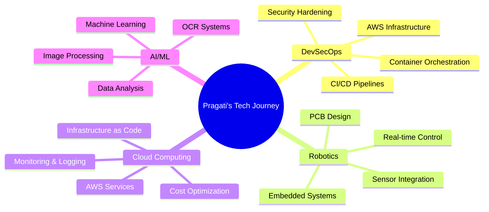

<div align="center">


</div>

<div align="center">
  
# 🚀 AWS Cloud Practitioner | DevSecOps Engineer | Robotics Innovator

### Building Secure, Scalable Cloud Infrastructure & Intelligent Robotic Systems

[](https://git.io/typing-svg)

[](https://www.linkedin.com/in/pragati-basnet-573106263/)
[](https://github.com/PragatiBasnet29)
[](mailto:pragatibasnet123@gmail.com)
[](#)

</div>

---

## 👋 About Me
<div align="center">
<table>
<tr>
<td>

**👤 Profile**
- 📛 Pragati Basnet
- 📍 Kathmandu, Nepal 🇳🇵
- 🎓 B.E. in Electronics & Communication Engineering
- 🏆 AWS Certified Cloud Practitioner
- 💼 DevSecOps Engineer | Robotics Developer

</td>
</tr>
</table>
</div>

### 🚀 What I Do

<div align="center">

| Area | Technologies & Skills |
|:-----|:---------------------|
| ☁️ **Cloud & Infrastructure** | AWS (EC2, Lambda, S3, IAM, CloudWatch), Azure |
| 🔒 **DevSecOps** | CI/CD, Docker, Kubernetes, Terraform, GitHub Actions, Nginx |
| 🤖 **Robotics & IoT** | Arduino, ESP32, Embedded Systems, PCB Design, Sensors |
| 💻 **Backend Development** | Python (Django, Flask), SQL, MySQL, REST APIs |
| 🔧 **Hardware Engineering** | Sensors, Motors, PID Control, Real-time Systems |
| 🎨 **Frontend & Design** | React, Next.js, Tailwind CSS, Figma |

</div>

> 💡 **Fun Fact:** I build robots that solve mazes and cloud systems that scale to millions! 🚀

---

## 💼 Professional Experience

### 🔒 DevSecOps Intern | Gritfeat Solution
**Jul 2025 - Nov 2025 | Remote**

```yaml
Responsibilities:
  - Built and maintained secure CI/CD pipelines with GitHub Actions
  - Hardened AWS environments using IAM, security groups, and NACLs
  - Containerized services with Docker and deployed on Kubernetes
  - Automated Linux server operations with Bash scripting
  - Implemented infrastructure as code using Terraform
  - Configured Nginx for reverse proxy and load balancing
  - Set up comprehensive monitoring with CloudWatch and CloudTrail
  
Technologies: AWS, Docker, Kubernetes, Terraform, GitHub Actions, Nginx, Linux
```

### 🔧 Hardware Quality Assurance Intern | RealTimeSolutions

```yaml
Projects:
  - Automated card-based door unlocking system (embedded C)
  - Tested submersible ultrasonic level sensors
  - Developed ESP32-S3 applications with 4-inch LED display
  - Real-time data visualization and sensor integration
  
Technologies: ESP32-S3, Embedded C, Sensors, Real-time Systems
```

---

## 🛠️ Technical Skills

<div align="center">

### ☁️ DevSecOps & Cloud Infrastructure


### 💻 Programming & Backend


### 🎨 Frontend & Design


### 🤖 Robotics & Hardware


### 🧠 AI/ML & Blockchain


</div>

---

## 🌟 Featured Projects

### 🔐 DevSecOps & Cloud Infrastructure

<div align="center">
<table>
<tr>
<td width="50%">

#### 🚀 DevOps Project with Frontend
**Complete CI/CD Pipeline Implementation**

- Infrastructure as Code with Terraform (HCL)
- Automated deployment workflows
- Container orchestration
- Frontend integration
- Production-ready DevOps pipeline

**Tech:** HCL, Terraform, Docker, CI/CD

⭐ **[View Project →](https://github.com/PragatiBasnet29/DevOpsProjectWithFrontEnd)**

</td>
<td width="50%">

#### ☁️ EKS on AWS
**Kubernetes Cluster Deployment**

- Amazon EKS cluster setup
- AWS infrastructure automation
- Container orchestration at scale
- Production Kubernetes deployment
- Cloud-native architecture

**Tech:** AWS EKS, Kubernetes, Terraform

⭐ **[View Project →](https://github.com/peedutronix/EKS-AWS)**

</td>
</tr>
<tr>
<td width="50%">

#### 🐳 Docker for Beginners
**Containerization Learning Path**

- Docker fundamentals
- Container best practices
- Multi-container applications
- Docker Compose workflows
- Practical examples

**Tech:** Docker, Containers, DevOps

⭐ **[View Project →](https://github.com/PragatiBasnet29/Docker-for-Beginner)**

</td>
<td width="50%">

#### 🔍 Prashna-Khoj
**Q&A Platform with DevOps**

- Full-stack Q&A application
- Docker containerization
- AWS EC2 deployment
- GitHub Actions CI/CD
- Complete DevOps workflow

**Tech:** JavaScript, Docker, AWS, GitHub Actions

⭐ **[View Project →](https://github.com/Ashim-Stha/Prashna-Khoj)**

</td>
</tr>
</table>
</div>

### 🤖 Robotics & IoT Systems

<div align="center">
<table>
<tr>
<td width="50%">

#### 🚨 Earthquake Alert System
**Real-time Disaster Warning IoT**

- ADXL accelerometer sensors
- P-wave detection across nodes
- GSM module for SMS alerts
- Multi-node sensor network
- Low-cost community safety system

**Tech:** Arduino, JavaScript, IoT, GSM, Sensors

⭐ **[View Project →](https://github.com/PragatiBasnet29/earthquake_and-_alter_system)**

</td>
<td width="50%">

#### 🔌 ESP-IDF Development
**Espressif IoT Framework**

- ESP32 firmware development
- Real-time embedded systems
- IoT device integration
- Low-level hardware programming
- ESP-IDF official framework

**Tech:** C, ESP32, ESP-IDF, Embedded Systems

⭐ **17.3k Stars** • **[Explore →](https://github.com/espressif/esp-idf)**

</td>
</tr>
</table>
</div>

### 🧠 Full-Stack & Web Development

<div align="center">
<table>
<tr>
<td width="50%">

#### 💊 Pharmacy Management System
**Healthcare Management Solution**

- Complete pharmacy workflow
- Inventory management
- Prescription tracking
- User-friendly interface
- Database integration

**Tech:** HTML, JavaScript, Database

⭐ **[View Project →](https://github.com/PragatiBasnet29/Pharmacy-management-system)**

</td>
<td width="50%">

#### 🏠 Real Estate Marketplace
**Blockchain Property Platform**

- Decentralized property transactions
- Smart contract integration
- Secure property listings
- Blockchain verification
- Modern web interface

**Tech:** JavaScript, Solidity, Blockchain, Web3

⭐ **[View Project →](https://github.com/Ashim-Stha/RealEstateMarketplace)**

</td>
</tr>
<tr>
<td width="50%">

#### ⚛️ 25 React Interview Projects
**React Learning Collection**

- 25 real-world React projects
- Interview preparation
- Best practices showcase
- Component patterns
- Hands-on learning

**Tech:** React, JavaScript, Frontend

⭐ **382 Stars** • **[Explore →](https://github.com/sangammukherjee/25-reactjs-interview-projects)**

</td>
<td width="50%">

#### 🤖 Langflow AI
**AI Workflow Builder**

- Visual AI agent builder
- Drag-and-drop workflows
- LLM integration
- Production-ready AI apps
- Open-source AI platform

**Tech:** Python, AI/ML, LangChain

⭐ **144.8k Stars** • **[Explore →](https://github.com/langflow-ai/langflow)**

</td>
</tr>
</table>
</div>

### 🔧 Hardware & VHDL

<div align="center">
<table>
<tr>
<td width="50%">

#### 💻 VHDL Lab Solutions
**Digital Design Projects**

- VHDL code solutions
- Past question implementations
- Digital circuit design
- Hardware description language
- FPGA programming

**Tech:** VHDL, Digital Design, FPGA

⭐ **1 Fork** • **[View Project →](https://github.com/PragatiBasnet29/VHDL-LAB)**

</td>
<td width="50%">

</td>
</tr>
</table>
</div>

---

## 📊 GitHub Statistics

<div align="center">


</div>

<div align="center">
  


</div>

<div align="center">

### 📈 Contribution Activity
[](https://github.com/PragatiBasnet29)

</div>

---

## 🏆 Achievements & Certifications

<div align="center">


</div>

### 🌟 Highlights

- ✅ **AWS Certified Cloud Practitioner** - Amazon Web Services
- 🎤 **AWS UG Women in Tech Meetup** - Organizer & Speaker (Pokhara)
- 🤖 **Robotics Club PR Manager** - Pashchimanchal Campus
- 👥 **Mentor & Hardware Lead** - Robotics Projects
- 🎓 **SheCan Fellowship** - Mentee
- 🦋 **Breaking Out of the Cocoon - Sequel** - Fellow
- 🏆 **Bolt Global Hackathon 2025** - Strong Positive Feedback (GharKoSWAD)
- 📝 **Research Paper** - Hardware Integrated OCR (In Progress)

---

## 💡 What I'm Currently Doing

<div align="center">

| 🎯 Focus Area | 📝 Current Activity |
|:---:|:---:|
| 🔭 **Working on** | Secure CI/CD pipelines & AWS infrastructure at Gritfeat Solution |
| 🌱 **Learning** | Advanced Kubernetes, AWS Solutions Architect, Security Best Practices |
| 👯 **Collaborating on** | Open-source DevOps tools & robotics projects |
| 💬 **Ask me about** | AWS, DevSecOps, Docker, Kubernetes, Robotics, Arduino, ESP32 |
| 📝 **Publishing** | Research paper on Devanagari OCR system |
| 🎤 **Speaking** | AWS & Cloud technologies at community meetups |

</div>

---

## 📚 Technical Blog & Writing

<div align="center">



</div>

<!-- BLOG-POST-LIST:START -->
- 🔐 Building Secure CI/CD Pipelines with GitHub Actions
- ☁️ AWS Best Practices: Security Groups vs NACLs
- 🤖 Real-time Earthquake Detection using IoT
- 🐳 Docker to Kubernetes: A Migration Guide
- 📊 Monitoring AWS Infrastructure with CloudWatch
<!-- BLOG-POST-LIST:END -->

---

## 🤝 Let's Connect!

<div align="center">

I'm always excited to collaborate on interesting projects, discuss cloud architecture, robotics, or just connect with fellow tech enthusiasts!

[](https://www.linkedin.com/in/pragati-basnet-573106263/)
[](https://github.com/PragatiBasnet29)
[](mailto:pragatibasnet123@gmail.com)

</div>

---

## 💭 Quote of the Day

<div align="center">


**"The cloud is limitless, robotics makes it tangible, and DevSecOps makes it secure."** 💫

</div>

---

<div align="center">

### 👁️ Profile Views Counter


<br>

### ⭐ If you like my work, consider giving a star to my repositories!

**Building the future, one commit at a time** 🚀

---

© 2026 Pragati Basnet | Made with ❤️ in Nepal 🇳🇵


</div>
